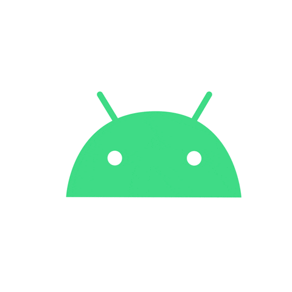

## 👋 Hi there, I'm Marcos!



[](https://linkedin.com/in/mrcsxsiq)
[](https://medium.com/@mrcsxsiq)
[](https://youtube.com/@mrcsxsiq)
[](https://x.com/mrcsxsiq)
<br/><br/>


### 🎓 About me:

```kotlin
val mrcsxsiq = developer {
    about = {
        name = "Marcos Paulo Farias"
    }
    tech("Kotlin", "Android", "KMP")
    links {
        blog = "https://marcos.dev"
    }
}
```
  
### 👩‍💻 Professional interests

🖥️ Deeply fascinated by all things in computer science.<br/>
📱 Developing intuitive and impactful Android and iOS applications using Kotlin Multiplatform.<br/>
🛠️ Continuously exploring new technologies and methodologies in software engineering.<br/>

### 🌱 What I'm up to

📖 Constantly learning and improving my skills in software engineering.<br/>
🔄 Contributing to open-source projects that catch my interest.<br/>

### 📈 Goals

🌟 To develop software that makes a difference.<br/>
🌐 To connect and collaborate with fellow developers and tech enthusiasts.<br/>

### 💪 Skills

[](https://linkedin.com/in/mrcsxsiq)
